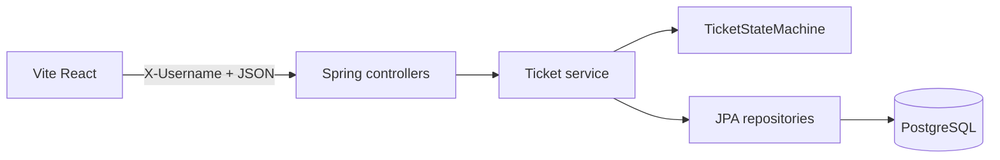

# Architecture

Status: Draft v3
Last updated: 2026-09-25

## Stack

- Backend: Java 21, **Spring Boot 4.x** (repo already uses 4.1.1), Spring Data JPA, PostgreSQL. **Gradle only** (`backend/`). Do not add Maven.
- Dependencies required beyond the Initializr skeleton: `spring-boot-starter-validation`; test: Testcontainers PostgreSQL (`org.springframework.boot` Testcontainers support or `org.testcontainers:postgresql` + JUnit).
- Frontend: Vite + React + TypeScript in `frontend/`. **CSS Modules only.**
- Persistence: PostgreSQL in **all** environments including tests. No H2.

## Layout

```
Controller → Service → Repository → Entity
```

Backend packages under `com.epic.sturdyfernacular`:

```
domain/          # Ticket, Comment, TicketStatus, Priority, PrototypeUsers
repository/
service/         # TicketService, TicketStateMachine (no Spring on the machine)
web/             # controllers, DTOs, advice, username filter, CORS config
```

- Controllers: mapping, `@Valid`, one service call. No business rules.
- Services: transitions, read-only/comment rules, create-time auto-assign (`assignee` missing/null → `X-Username`), assignee never cleared, copying `X-Username` onto `createdBy` / `updatedBy` / `author`.
- Repositories: `JpaRepository`; search via derived or `@Query` JPQL/SQL with `ILIKE`.
- Entities are not returned from controllers. Separate request and response DTOs.



## Local Postgres (Compose)

Root or `backend/` `docker-compose.yml`:

- Image `postgres:16`
- Database `tickets`, user `tickets`
- Host port `5432`
- Named volume (required for restart-survival NFR)
- Password only via Compose env / `.env` (gitignored); committed compose uses `${POSTGRES_PASSWORD}`

Backend `application.yaml` (committed, no secrets):

```yaml
spring:
  datasource:
    url: ${SPRING_DATASOURCE_URL:jdbc:postgresql://localhost:5432/tickets}
    username: ${SPRING_DATASOURCE_USERNAME:tickets}
    password: ${SPRING_DATASOURCE_PASSWORD:}
  jpa:
    hibernate:
      ddl-auto: update
    open-in-view: false
  jackson:
    time-zone: UTC
    serialization:
      write-dates-as-timestamps: false
```

Gitignore: `application-local.properties`, `.env`, `frontend/.env`. Document copies in `.env.example`.

**Alternative considered:** H2 file mode for local. Rejected: dialect drift vs `ILIKE` and assignment NFR.

## Prototype identity

- Allowlist constant on the server: `alice`, `bob`, `carol`.
- Filter/interceptor rejects missing/unknown `X-Username` with the standard 400 body for **non-OPTIONS** `/api/v1/**` requests.
- Skip `OPTIONS` so CORS preflight succeeds (FR14).
- Not authentication: anyone who can reach the API can impersonate a prototype user. Do not add JWT.
- **Alternative considered:** `User` entity + `GET /users`. Rejected: no login, three fixed names.

## State machine

- Class with zero Spring annotations (e.g. `TicketStateMachine`).
- Input: current status, target status. Output: allow or reject. Unit-tested for every matrix cell in `spec/state-machine.md`.
- Invoked only from the service method behind `PATCH /tickets/{id}/status`.

## Search

- PostgreSQL `ILIKE` on `title` and `description`, OR’d, combined with optional `status` equality and pagination.
- Escape `%` and `_` in the keyword so user input is literal.

## Pagination

- Spring `Pageable`: `page` default 0, `size` default 10, max 100. Values outside range → 400, not silent clamp.
- UI only sends 10, 50, or 100.

## Time, ids, enums

- `@CreationTimestamp` / `@UpdateTimestamp` (UTC).
- Surrogate `Long` ids.
- Persist and JSON-serialize enums as names (`OPEN`, not ordinal).

## HTTP and CORS

- Base path `/api/v1`. Server port default `8080`.
- CORS: origin `http://localhost:5173` (Vite default). Methods GET, POST, PATCH, OPTIONS. Headers `Content-Type`, `X-Username`.
- Structured errors via one `@RestControllerAdvice`, including `HttpMessageNotReadableException` and `MethodArgumentTypeMismatchException` → 400 `VALIDATION_ERROR`.

## Secrets

- Datasource password never committed.
- Frontend: `.env.example` with `VITE_API_BASE_URL=http://localhost:8080`.

## Frontend structure

```
src/api/        # client + resource functions
src/types/      # DTOs matching this contract
src/pages/
src/components/
src/hooks/
```

## Testing (architectural)

- State machine: plain unit tests, full 5×5 matrix.
- Controllers: `@WebMvcTest`, include `X-Username`; one test without header; one `OPTIONS` without header expecting CORS success (not 400).
- Persistence / search: Testcontainers PostgreSQL. Shared test compose/container config so `@SpringBootTest` / `@DataJpaTest` do not hit a missing local DB.
- Do not add H2 “just for tests.”
- Frontend: loading / empty / error / terminal vs comment-on-closed.

## Local run

1. `docker compose up -d` (Postgres).
2. Export datasource env or copy `.env.example`.
3. `backend`: `./gradlew bootRun`.
4. `frontend`: `npm run dev` on port 5173; API base `http://localhost:8080`.
