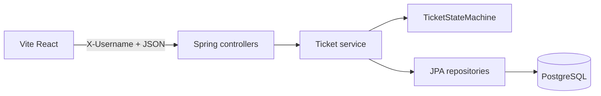

# Architecture

Status: Draft v2
Last updated: 2026-09-25

## Stack

- Backend: Java 21, Spring Boot, Spring Data JPA, PostgreSQL. Maven or Gradle — match the first build file added; do not add a second.
- Frontend: Vite + React + TypeScript. One styling approach (CSS Modules or Tailwind), chosen at implementation start.
- Persistence: PostgreSQL in **all** environments (local via Docker Compose). No H2.

## Layout

```
Controller → Service → Repository → Entity
```

- Controllers: mapping, `@Valid`, one service call. No business rules.
- Services: transitions, read-only/comment rules, create-time auto-assign (`assignee` missing/null → `X-Username`), assignee never cleared, copying `X-Username` onto `createdBy` / `updatedBy` / `author`.
- Repositories: `JpaRepository`; search via derived or `@Query` JPQL/SQL with `ILIKE`.
- Entities are not returned from controllers. Separate request and response DTOs.



## Prototype identity

- Allowlist constant on the server: `alice`, `bob`, `carol`.
- Filter/interceptor rejects missing/unknown `X-Username` with the standard 400 body before controllers that need a ticket.
- Not authentication: anyone who can reach the API can impersonate a prototype user. Acceptable for this prototype; do not add JWT “to be safe.”
- **Alternative considered:** `User` entity + `GET /users`. Rejected: no login, three fixed names, extra surface for no benefit.

## State machine

- Class with zero Spring annotations (e.g. `TicketStateMachine`).
- Input: current status, target status. Output: allow or reject. Unit-tested for every matrix cell in `spec/state-machine.md`.
- Invoked only from the service method behind `PATCH /tickets/{id}/status`.
- **Alternative considered:** JPA entity setters that change status. Rejected: easy to bypass from a generic update.

## Search

- PostgreSQL `ILIKE` on `title` and `description`, OR’d, combined with optional `status` equality and pagination.
- Escape `%` and `_` in the keyword so user input is literal.
- **Alternative considered:** `tsvector`. Rejected for prototype size; revisit if ranking is needed.

## Pagination

- Spring `Pageable`: `page` default 0, `size` default 10, max 100 (`Pageable` resolver / custom resolver that clamps or rejects > 100 with 400).
- UI only sends 10, 50, or 100.

## Time and ids

- `@CreationTimestamp` / `@UpdateTimestamp` (UTC). Do not scatter `LocalDateTime.now()`.
- Surrogate `Long` ids.

## HTTP and CORS

- Base path `/api/v1`.
- CORS: explicit frontend origin (Vite dev server), not `*` with credentials. Prototype may omit cookies; still list explicit origins.
- Structured errors via one `@RestControllerAdvice`.

## Secrets

- Datasource URL/user/password: env or gitignored `application-local.properties`.
- Frontend: `.env.example` with `VITE_API_BASE_URL` only; no real secrets.

## Frontend structure

```
src/api/        # client + resource functions
src/types/      # DTOs matching this contract
src/pages/
src/components/
src/hooks/
```

## Testing (architectural)

- State machine: plain unit tests, full 5×5 matrix.
- Controllers: `@WebMvcTest`, include `X-Username`.
- Search/list: Testcontainers PostgreSQL when SQL `ILIKE` behavior matters.
- Frontend: loading / empty / error / terminal vs comment-on-closed.

## Local run (documentation when implemented)

- Docker Compose: PostgreSQL 16.
- Backend + Vite; CORS origin matches Vite port.
